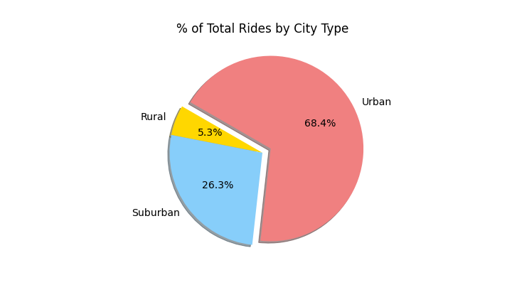
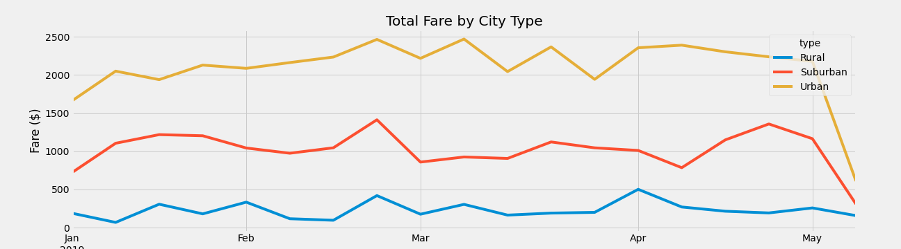
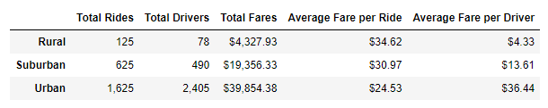

# PyBer_Analysis
Looking at ride share data to determine and help improve access to ride share services and affordability in under served areas.

## Deliverable 1: A ride-sharing summary DataFrame by city type.
The PyBer Summary DataFrame provides an overview comparison of PyBer's ridesharing services in three types of cities: rural, surburban, and urban cities. The summary demonstrates that there is a larger demand for PyBer among riders in urban cities compared to suburban and rural cities. Between January 2019 and May 2019, there were 1,625 rides in urban cities, 625 rides in suburban cities, and 125 rides in rural cities. The figure below highlights how rides in Urban cities contributed the most to PyBer's overall rides during this five-month period.

## Deliverable 2: A multiple-line chart of total fares for each city type.

## Summary
