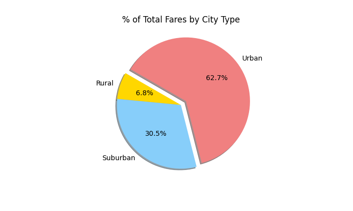

# PyBer_Analysis
Looking at ride share data to determine and help improve access to ride share services and affordability in underserved areas.

## Deliverable 1: A ride-sharing summary Data Frame by city type.
The PyBer Summary Data lets us compare PyBer’ s ridesharing services. 
We have broken the data down by city type into three types of cities:
* Rural
* Suburban
* Urban
The data is sampled from a 5-month period between January 2019 and May 2019.

We can see right away that there is a bigger demand for ride sharing services in Urban cities compared to the Suburban and Rural ones.

As in the past example, when we break the service down by drivers in each city type the data follows the same pattern. Urban cities employ a larger volume of  drivers than Suburban or Rural cities. 
Urban cities have almost 5 times the number of drivers than the Suburban cities and 31 times more than the amount in Rural cities. Meanwhile, Suburban cities have a little more than 6 times the number of drivers than Rural cities.

The total fares by city type show a huge price increase when outside of the Urban cities. This can be attributed to the great usage of PyBer in the Urban cities. PyBer made a total of nearly $40,000 in the Urban cities, compared to $19,000 in the Suburban cities and $4,000 in the Rural ones. 

When we break it down in terms of cost to the rider per ride, Rural cities pay on average of about $10 more for PyBer ride sharing services than the riders in Urban cities. Rural cities show an average of $34.62 fare per ride whereas the average fare per ride is $24.53 in Urban cities. The average in Suburban cities is $30.97. The average fare per ride in Rural areas may hurt the rider’s pocketbook but may help the driver. This in demonstrated by the average fare per driver. In Rural cities it totals to $55.49, $16.57 in Urban cities and $39.50 in Suburban ones.

## Deliverable 2: A multiple-line chart of total fares for each city type.

Our summary data shows a relationship between the city type and the fare revenue when there is a larger ratio of drivers to rides.

In the multiple-line chart below, it further demonstrates the PyBer Data Summary. Again, showing the trends of total fares in Rural, Suburban, and Urban cities between January 2019 and April 2019.

Breakdown:
* Yellow = Total fares in Urban cities
  * Which totals around $1,600 to $2,300
* Blue =  Total fares in Rural cities 
  * Which totals around $300. 
* Orange = Total fares in Suburban cities 
  * Which totals around $700 to $1,300. 
 
 
The chart shows similar peak times in all these types of cities. Peaking for all sometime at the end of February 2019.

## Summary
Rural PyBer riders on average pay more for rides. This can be attributed to the higher population in Urban Cities. Which has led to a bigger driver pool in these areas and allows the PyBer riders to pay lower fare rates. The Urban areas proved to be the bigger generator in revenues. In Rural cities the average fare per ride and average fare per driver is much higher than Suburban and Urban cities. One possible indicator is that Rural city-based riders are likely taking trips over a longer distance. To sum up, PyBer rider sharing services significantly differs depending on the city type and given the number of rides, drivers, and fares. Our data shows that the highest usage of PyBer ridesharing services in Urban cities.
